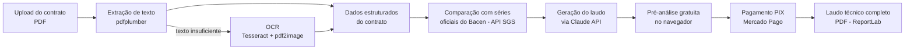

# Laudo Juros

[](https://www.python.org/)
[](https://fastapi.tiangolo.com/)
[](https://react.dev/)
[](https://www.postgresql.org/)
[](https://www.laudojuros.com.br/)

Plataforma que analisa contratos de empréstimo e financiamento em busca de juros abusivos, comparando as taxas cobradas com as séries oficiais do Banco Central em tempo real e gerando um laudo técnico em PDF.

**Produto em produção:** [laudojuros.com.br](https://www.laudojuros.com.br/)

## O problema

Bancos e financeiras no Brasil frequentemente cobram taxas de juros muito acima da média de mercado praticada para a mesma modalidade de crédito. O STJ (REsp 1.061.530/RS) considera abusiva a taxa que supera o dobro da média divulgada pelo Banco Central. Identificar isso manualmente exige cruzar o contrato com as séries temporais do Bacen (SGS) e interpretar cláusulas técnicas — o que a maioria dos consumidores não tem como fazer sozinha.

## Como funciona



1. **Upload**: o usuário envia o contrato em PDF pelo frontend.
2. **Extração de texto**: o backend tenta extrair o texto diretamente com `pdfplumber`; se o conteúdo extraído for insuficiente (contrato escaneado como imagem), cai para OCR com `pytesseract` + `pdf2image` (Tesseract em português).
3. **Consulta ao Bacen**: a taxa média de mercado da modalidade selecionada (consignado INSS, consignado CLT, crédito pessoal, financiamento de veículo, cartão de crédito, etc.) é buscada ao vivo na API SGS do Banco Central, por código de série oficial — sem valores fixos no código. Selic e CDI também são consultados para dar contexto.
4. **Análise via IA**: o texto do contrato e o contexto de taxas do Bacen são enviados à API da Anthropic (Claude), que identifica irregularidades e calcula o impacto financeiro comparando com o limiar de abusividade (2x a taxa média, conforme entendimento do STJ).
5. **Pré-análise gratuita**: o usuário recebe um resumo do resultado antes de pagar.
6. **Pagamento**: liberação do laudo completo via PIX, processado pelo Mercado Pago.
7. **Laudo técnico**: geração do documento final em PDF com `ReportLab`, contendo taxas, fundamentação e fontes oficiais citadas.

## Stack técnica

### Backend
- **Python 3.11** + **FastAPI** (API assíncrona)
- **SQLAlchemy (async)** com **PostgreSQL** em produção (SQLite para desenvolvimento/testes)
- **Autenticação**: JWT (`python-jose`) com suporte a usuários convidados (guest)
- **OCR**: `pytesseract` + `pdf2image` (Poppler) como fallback quando `pdfplumber` não extrai texto suficiente
- **IA**: SDK oficial `anthropic` para geração do laudo
- **Pagamentos**: SDK `mercadopago` (PIX)
- **Geração de PDF**: `reportlab`
- **Deploy**: Docker (Dockerfile próprio, com Tesseract e Poppler instalados) via Railway

### Frontend
- **React 18** + **Vite** (`vite-react-ssg`)
- **React Router**, **Tailwind CSS**, **Axios**
- **Deploy**: Vercel

## Estrutura do projeto

```
backend/
  main.py              # bootstrap da FastAPI, CORS, rotas
  models.py            # modelos SQLAlchemy (Contract, Analysis, Payment, User)
  database.py          # engine assíncrono e sessão
  routers/
    auth.py            # autenticação e usuários convidados
    contracts.py        # upload e status da análise do contrato
    reports.py          # geração e download do laudo em PDF
    payments.py          # criação e webhook de pagamento PIX
    public.py            # endpoints públicos (métricas, health)
  services/
    analysis_service.py  # extração de texto/OCR, prompt e chamada à IA
    bcb_service.py        # integração com a API SGS do Banco Central
    report_service.py      # geração do PDF do laudo técnico
    payment_service.py      # integração com Mercado Pago
    ai_ops_service.py        # controle de capacidade/custo de IA
    stj_service.py            # referências de jurisprudência do STJ
frontend/
  src/                 # aplicação React (páginas, componentes, integração com a API)
```

## Rodando localmente

### Backend
```bash
cd backend
pip install -r requirements.txt
cp ../.env.example .env.local   # preencha ANTHROPIC_API_KEY e SECRET_KEY
uvicorn main:app --reload
```
Requer `tesseract-ocr` (idioma `por`) e `poppler-utils` instalados no sistema para o fallback de OCR funcionar.

### Frontend
```bash
cd frontend
npm install
npm run dev
```

## Principais endpoints

| Método | Rota | Descrição |
|---|---|---|
| `POST` | `/api/contracts/upload` | Upload do PDF e início da análise em background |
| `GET`  | `/api/contracts/{id}/status` | Status da análise (pendente/concluída/falha) |
| `GET`  | `/api/contracts/history` | Histórico de contratos do usuário |
| `POST` | `/api/payments/*` | Criação e confirmação de pagamento PIX |
| `GET`  | `/api/reports/*` | Geração/download do laudo em PDF |
| `GET`  | `/health` | Healthcheck usado pelo Railway |

## Aviso legal

O laudo gerado é um documento técnico de apoio, baseado em dados públicos do Banco Central e jurisprudência do STJ. Não constitui consultoria jurídica.
